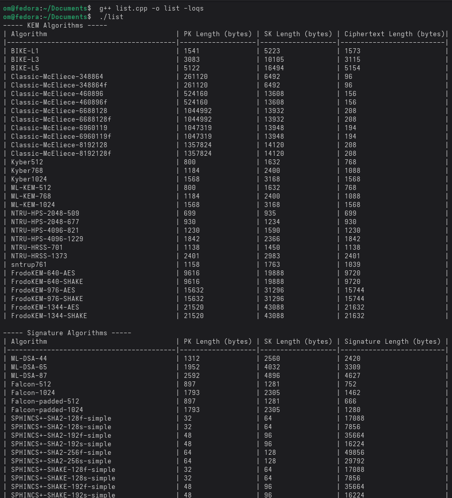
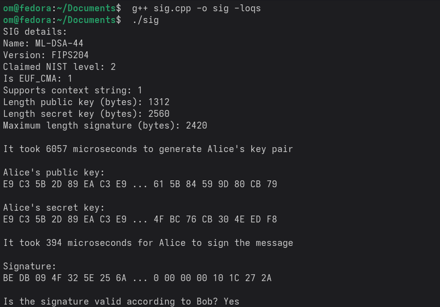

# Exploring PQC with liboqs

---

## Overview

liboqs provides:

- a collection of open source implementations of quantum-safe key encapsulation mechanisms (KEMs) and digital signature algorithms; the full list can be found [here](#supported-algorithms)
- a common API for these algorithms
- a test harness and benchmarking routines

liboqs is part of the **Open Quantum Safe (OQS)** project, which aims to develop and integrate into applications quantum-safe cryptography to facilitate deployment and testing in real world contexts. In particular, OQS provides prototype integrations of liboqs into protocols like TLS, X.509, and S/MIME, through [OpenSSL 3 Provider](https://github.com/open-quantum-safe/oqs-provider) and provides a variety of other [post-quantum-enabled demos](https://github.com/open-quantum-safe/oqs-demos).

---

## Installation

### Install dependencies

On Ubuntu:

```shell
sudo apt install git cmake gcc g++
```

On Fedora:

```shell
sudo dnf install git cmake gcc-c++
```

### Configure, build and install liboqs

On Ububtu and Fedora:

```shell
git clone --depth=1 https://github.com/open-quantum-safe/liboqs
cmake -S liboqs -B liboqs/build -DBUILD_SHARED_LIBS=ON
cmake --build liboqs/build --parallel 8
sudo cmake --build liboqs/build --target install
```

Change `--parallel 8` to match the number of available cores on your system.

#### Set library path

On Ubuntu:
```shell
export LD_LIBRARY_PATH=$LD_LIBRARY_PATH:/usr/local/lib
```

On Fedora:
```shell
export LD_LIBRARY_PATH=$LD_LIBRARY_PATH:/usr/local/lib64
```

#### Alternatively, to make it persistent

On Ubuntu:
```shell
echo "/usr/local/lib" | sudo tee /etc/ld.so.conf.d/liboqs.conf
sudo ldconfig
```

On Fedora:
```shell
echo "/usr/local/lib64" | sudo tee /etc/ld.so.conf.d/liboqs.conf
sudo ldconfig
```

### Configure and install the C++ wrapper

```shell
git clone --depth=1 https://github.com/open-quantum-safe/liboqs-cpp
cmake -S liboqs-cpp -B liboqs-cpp/build
cmake --build liboqs-cpp/build --target install
```

## Using liboqs-cpp in standalone applications

liboqs-cpp is a header-only wrapper. To use liboqs-cpp, you only need
to use

```cpp
#define LIBOQS_CPP_VERSION "0.14.0"
#include <liboqs-cpp/oqs_cpp.hpp>
```

Change `LIBOQS_CPP_VERSION` with the version installed on your system.

To avoid namespace pollution, liboqs-cpp includes all of its code inside the
namespace `oqs`. All the liboqs C API is located in the namespace `oqs::C`,
hence to use directly a C API function you must qualify the call
with `oqs::C::liboqs_C_function(...)`.

If you want to use all functions from the `oqs::C` namespace directly without qualification, you need to use

```cpp
using namespace oqs;
```

## Compile and execute a program

```shell
git clone https://github.com/MTech-IT-MNS-2025/Group-1.git
cd Group-1/Assignment2/
```

#### 1. List all supported KEM and SIG algorithms
```shell
g++ list.cpp -o list -liboqs
./list
```
<p align="center">
  
</p>

#### 2. Key exchange using a KEM algorithm
```shell
g++ kem.cpp -o kem -liboqs
./kem
```

<p align="center">
  
</p>

#### 3. Digital signature using a SIG algorithm
```shell
g++ sig.cpp -o sig -liboqs
./sig
```

<p align="center">
  
</p>
