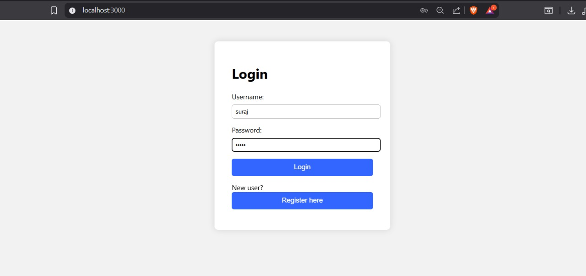
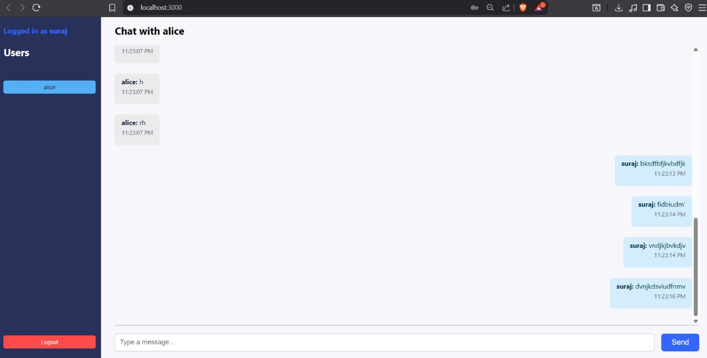
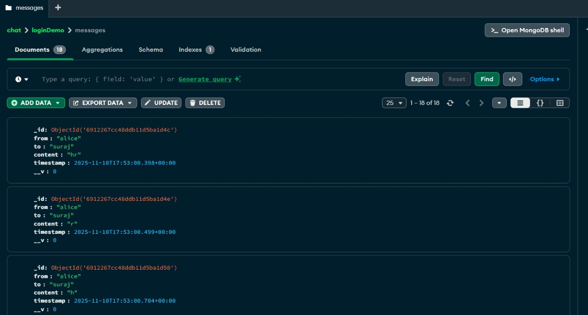

# Private Messaging Application

---

## Overview

This assignment implements a real-time, one-to-one private messaging application using **Next.js** for the frontend and **Socket.io** for real-time communication. The application allows users to send and receive messages securely in a private chat interface. It also stores chat history in a **MongoDB** database to ensure messages are available even when users are offline or reconnect.

### Key Features
- **User Authentication**: Users enter a username to connect and gain access to the chat system.
- **Real-Time Messaging**: Using **Socket.io**, users can send and receive messages instantly.
- **Chat History**: Messages are stored in a **MongoDB** database and are retrieved on user login to show the previous chat history.
- **Private Messaging**: Users can message one another privately using the app's chat interface.
- **Responsive UI**: The chat interface is designed with either **CSS Modules** or **Tailwind CSS** for a clean, user-friendly experience.

---

## Installation

### Install Node.js and npm

On Ubuntu:

```shell
sudo apt install nodejs npm
```

On Fedora:

```shell
sudo dnf install nodejs npm
```

Alternatively node.js can be installed using nvm

```shell
curl -o- https://raw.githubusercontent.com/nvm-sh/nvm/v0.40.3/install.sh | bash
\. "$HOME/.nvm/nvm.sh"
nvm install 22
```

### Install MongoDB

On Ububtu:

```shell
sudo apt-get install gnupg curl
curl -fsSL https://www.mongodb.org/static/pgp/server-8.0.asc | sudo gpg -o /usr/share/keyrings/mongodb-server-8.0.gpg --dearmor
echo "deb [ arch=amd64,arm64 signed-by=/usr/share/keyrings/mongodb-server-8.0.gpg ] https://repo.mongodb.org/apt/ubuntu noble/mongodb-org/8.0 multiverse" | sudo tee /etc/apt/sources.list.d/mongodb-org-8.0.list
sudo apt-get update
sudo apt-get install mongodb-org
```

On Fedora:

```shell
sudo nano /etc/yum.repos.d/mongodb-org-8.2.repo
...
[mongodb-org-8.2]
name=MongoDB Repository
baseurl=https://repo.mongodb.org/yum/redhat/9/mongodb-org/8.2/x86_64/
gpgcheck=1
enabled=1
gpgkey=https://pgp.mongodb.com/server-8.0.asc
...
sudo dnf update
sudo yum install mongodb-org
```

Start MongoDB and check status:

```shell
sudo systemctl enable mongod
sudo systemctl start mongod
sudo systemctl status mongod
```

### Install MongoDB Compass

Download and Install MongoDB Compass from 

```shell
https://www.mongodb.com/try/download/compass
```

## Run the Application

```shell
git clone https://github.com/MTech-IT-MNS-2025/Group-1.git
```

in Assignment3 folder

```shell
cd backend
node server.js
```

```shell
cd frontend
npm start
```
Open frontend in browser

<p align="center">
  
</p>

<p align="center">
  
</p>

<p align="center">
  
</p>

## Architecture

```shell
├───backend
│       db.js
│       package.json
│       server.js
│
├───frontend
│   │
│   ├───public
│   │       index.html
│   │
│   └───src
│           App.css
│           App.js
│           index.css
│           index.js
```

## Technologies Used
- **Frontend & Backend**: 
  - **React**: Library for web and native user interfaces.
  - **Node.js**: Backend runtime to handle API routes and real-time messaging logic.
- **Real-Time Communication**:
  - **Socket.io**: WebSocket library for real-time, bidirectional communication.
- **Database**:
  - **MongoDB**: Database used to persist messages and user data.
- **Styling**:
  - **CSS Modules** or **Tailwind CSS** for designing the user interface.

## Learning Outcomes
1. Built full-stack applications using React.
2. Implement one-to-one real-time messaging.
3. Store messages in a database (MongoDB) to maintain chat history.
4. Display previous messages when a user logs in or opens a chat.
5. Understand user session management and message routing for private communication.

## Contributions

Contribution details of each member is listed in `CONTRIBUTIONS.txt`
