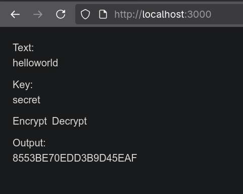
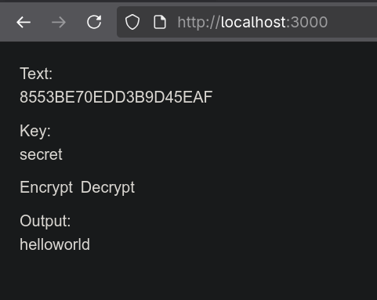

# Compile C code to WebAssembly and execute in browser using JavaScript

---

## Overview


---

## Installation

### Install git

```shell
# On Ubuntu
sudo apt install git

# On Fedora
sudo dnf install git
```

### Install emsdk

```shell
# Get the emsdk repo
git clone https://github.com/emscripten-core/emsdk.git

cd emsdk

# Download and install the latest SDK tools.
./emsdk install latest

# Fetch the latest registry of available tools.
./emsdk update

# Make the "latest" SDK "active" for the current user. (writes .emscripten file)
./emsdk activate latest

# Activate PATH and other environment variables in the current terminal
source ./emsdk_env.sh
```

If you want to avoid executing source ./emsdk_env.sh every time you open a new terminal, you can follow the instructions given by the emsdk activate command above to add this command to your startup scripts.

Emscripten, like gcc and clang, generates unoptimized code by default. Code is optimized by specifying optimization flags when running emcc. The levels include: `-O0` (no optimization), `-O1`, `-O2`, `-Os`, `-Oz`, `-Og`, and `-O3`.


### Making rc4.js and rc4.wasm

```shell
emcc rc4.c -o rc4.js -Oz --closure 1 -sEXPORTED_FUNCTIONS=_rc4_encrypt,_rc4_decrypt,_free -sEXPORTED_RUNTIME_METHODS=cwrap
```

You should see two files generated by that command: rc4.js and rc4.wasm. The second is a WebAssembly file containing the compiled code, and the first is a JavaScript file containing the runtime support to load and execute it.

### Install Node.js and npm

```shell
# On Ubuntu
sudo apt install nodejs npm

# On Fedora
sudo dnf install nodejs npm

# Alternatively node.js can be installed using nvm
curl -o- https://raw.githubusercontent.com/nvm-sh/nvm/v0.40.3/install.sh | bash
\. "$HOME/.nvm/nvm.sh"
nvm install 22
```

### Running the app

In Assignment4 folder,

```shell
npm install
npm run dev
```

Open frontend in browser

<div style="display: flex; justify-content: center; gap: 30px; text-align: center;">
  <figure>
    
    <figcaption><strong>RC4 Encryption</strong></figcaption>
  </figure>

  <figure>
    
    <figcaption><strong>RC4 Decryption</strong></figcaption>
  </figure>
</div>


## Architecture

```shell
Assignment4
│
├───app
│       page.js
│
├───public
        rc4.c
        rc4.js
        rc4.wasm
```

## Technologies Used


## Learning Outcomes
1. How to compile C code to WebAssembly using Emscripten.
2. How to expose C functions to JavaScript.
3. How to call native C (via WASM) from a Next.js frontend.
4. How to handle text input/output between JavaScript and WASM memory.

## Contributions

Contribution details of each member is listed in `CONTRIBUTIONS.txt`
